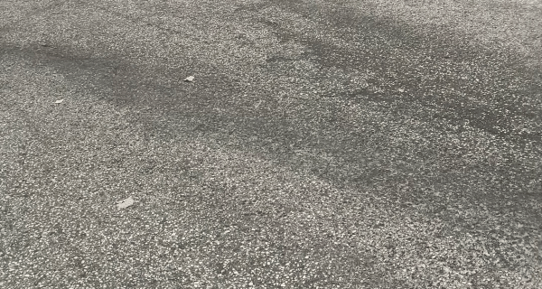
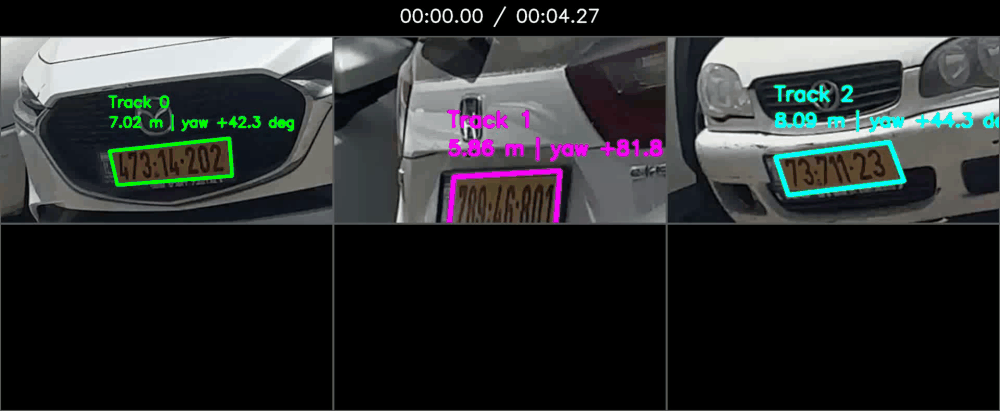
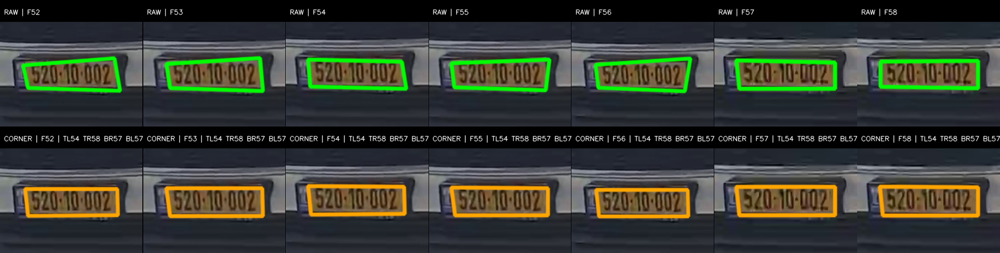
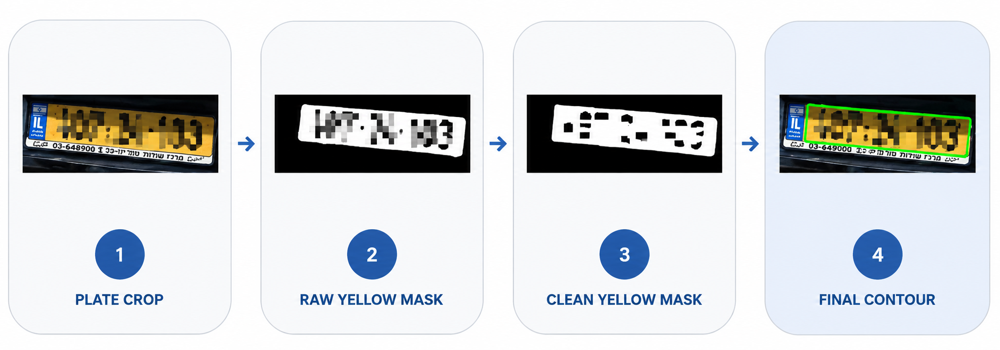
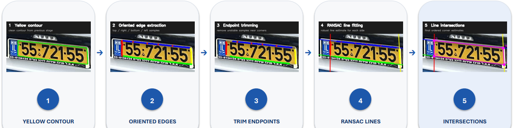
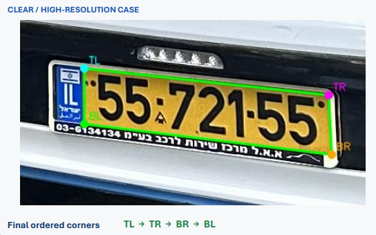
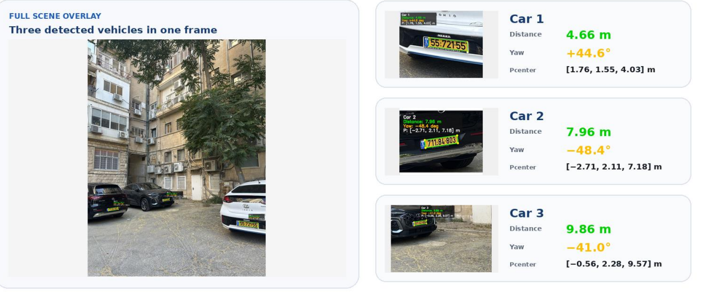
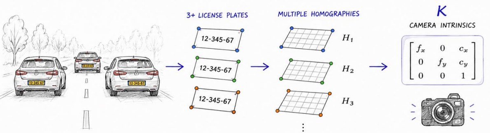
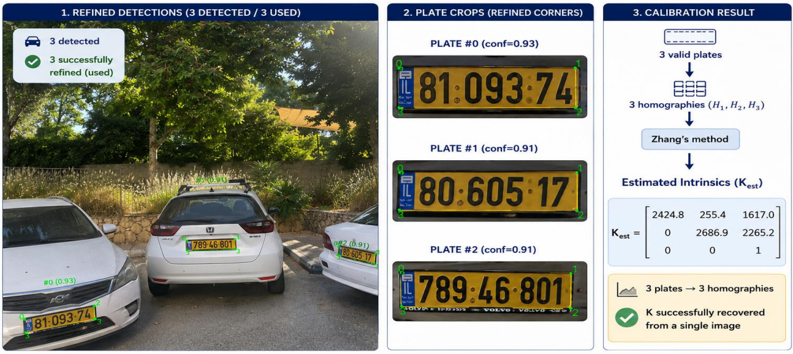

# License Plate Pose Estimation & Camera Calibration

Estimating vehicle distance and orientation from license plates using geometric and temporal computer vision — from single images to multi-object video tracking.

<p align="center">
  
</p>

The final system detects and tracks multiple license plates in video, refines their geometry across neighboring frames, and estimates **distance and yaw** relative to the camera.

---

## Video Pose Estimation

The video pipeline combines single-frame geometry with temporal information:

```text
Video
  ↓
License Plate Detection
  ↓
Tracking
  ↓
Single-Frame Corner Refinement
  ↓
7-Frame Temporal Corner Refinement
  ↓
Planar PnP
  ↓
Distance + Yaw
  ↓
Temporal Pose Smoothing
```

### Multi-Plate Tracking

Each detected plate is associated with a persistent track, allowing its pose to be estimated continuously as the camera and vehicles move.

The zoomed view below shows the individual tracks more clearly:

<p align="center">
  
</p>

### Temporal Corner Refinement

Pose estimation depends strongly on the accuracy of the four plate corners. A corner that is slightly inaccurate in one frame may be much better localized in a neighboring frame.

Instead of treating every frame independently, the video pipeline builds a 7-frame window for each track. Plate observations are geometrically aligned, and corner candidates from neighboring frames are evaluated to construct a more reliable corner estimate.

<p align="center">
  
</p>

This allows different corners to use evidence from different frames rather than forcing the complete quadrilateral to come from a single observation.

---

## From a Single Image to Video

The video system is the final stage of a broader investigation into the geometry available from license plates.

A license plate is especially useful because it provides a **planar object with known physical dimensions**. Once its four image corners are known, the plate can act as a metric reference for both pose estimation and camera calibration.

The project developed through three main stages:

### 1. Single-Image Pose Estimation

The first stage estimates vehicle pose from a single image with known camera
intrinsics.

After detecting the license plate, the inner yellow region is extracted and
cleaned to obtain a reliable geometric contour.

<p align="center">
  
</p>

The four plate corners are then recovered using a robust geometric refinement
pipeline. Contour samples are classified by edge orientation, unstable samples
near the endpoints are removed, and each physical edge is fitted independently
using RANSAC. The final corners are obtained from intersections of neighboring
lines.

<p align="center">
  
</p>

The intersections of the fitted edges produce the final ordered corners
`TL → TR → BR → BL`.

<p align="center">
  
</p>

With these four image points and the known physical dimensions of the plate,
planar PnP (IPPE) is used to recover the plate rotation and translation relative
to the camera. Distance is obtained from the translation vector, while yaw is
extracted from the recovered plate orientation.

<p align="center">
  
</p>

This produces a metric pose estimate for each detected vehicle, including its
**3D position, camera-to-plate distance, and yaw angle**.

### 2. Camera Calibration from Multiple Plates

The single-image pose pipeline assumes that the camera intrinsic matrix `K` is
already known. The next stage explored whether the license plates themselves
could also be used as calibration targets.

Because each plate is a planar rectangle with known physical dimensions, every
visible plate provides a homography between the plate plane and the image.
With three or more plates observed under different orientations, these
homographies provide independent constraints on the camera intrinsics.

<p align="center">
  
</p>

The homographies are combined using **Zhang-style calibration constraints** to
estimate the intrinsic matrix:

```text
Multiple Plates
      ↓
Homography per Plate
      ↓
Zhang Constraints
      ↓
Camera Intrinsics K
```

The method was evaluated on real images containing multiple vehicles and
compared against a reference calibration obtained using a chessboard.

<p align="center">
  
</p>

The experiments showed that license plates can provide enough geometric
constraints to recover plausible camera intrinsics, but also revealed an
important limitation: **single-image calibration is highly sensitive to corner
accuracy and to the geometric diversity of the observed plates**.

In particular, even sub-pixel changes in the detected corners could produce
large changes in the estimated intrinsic parameters. This reinforced one of the
main findings of the project — when known plate geometry is used as a metric
reference, precise and stable corner localization is critical.


### 3. Why Move to Video?

Experiments throughout the project consistently pointed to corner accuracy as a critical source of uncertainty.

Metric distance remained relatively stable, while orientation and camera intrinsics were considerably more sensitive to small changes in the detected corners.

Video provides something a single image cannot: **multiple observations of the same physical plate over time**.

This motivated the final temporal pipeline shown at the top of this README, where tracking and neighboring frames are used to improve geometric consistency before computing the final pose.

---

## Key Results

| Evaluation | Result |
| --- | ---: |
| Frontal distance MAE (1–5 m) | **1.4 cm** |
| Yaw MAE | **2.94°** |
| Mean yaw variation across distance | **0.81°** |
| `σ = 5 px` corner noise → mean distance change | **7.64 cm** |
| `σ = 5 px` corner noise → mean yaw change | **10.30°** |

Across the experiments, **distance estimation remained relatively robust,
while yaw was substantially more sensitive to corner localization**.

The calibration experiments amplified this effect even further: small
sub-pixel changes in the plate corners could produce large variations in the
estimated camera intrinsics.

These findings motivated the transition from independent single-frame
estimates to the temporally refined video pipeline.

---
## Repository Structure

```text
calibration/             Camera calibration from video
corner_refinement/       Robust single-image plate corner extraction
multi_plate_new/         Multi-plate intrinsic calibration experiments
single_plate_pose/       Single-image 3D pose, distance, and yaw estimation
video_pose/              Tracking, temporal refinement, and video pose pipeline
assets/                  README figures and demo animations
```

The final video pipeline is implemented in `video_pose/`, with
`video_pose/run_video_pose.py` serving as the main entry point.

---

## Limitations

- Pose accuracy depends strongly on precise plate-corner localization,
  particularly for yaw estimation.
- Metric pose estimation requires known camera intrinsics; calibration from
  plates alone was found to be sensitive to corner accuracy and scene geometry.
- Temporal refinement depends on maintaining a reliable track across neighboring
  frames.

---

## Future Work

The most direct next step is to replace parts of the handcrafted yellow-region
extraction with a learned segmentation model fine-tuned specifically for
Israeli license plates. This could provide cleaner and more consistent plate
boundaries under difficult lighting, distance, and viewing angles.

Further extensions could explore longer-track temporal optimization and
multi-view camera calibration.

---

## Contact

This project was built primarily as a technical portfolio and research showcase.

If you are interested in the project, the experiments, or discussing the
computer vision approach in more detail, feel free to reach out:

**Email:** st.ariel100@gmail.com
